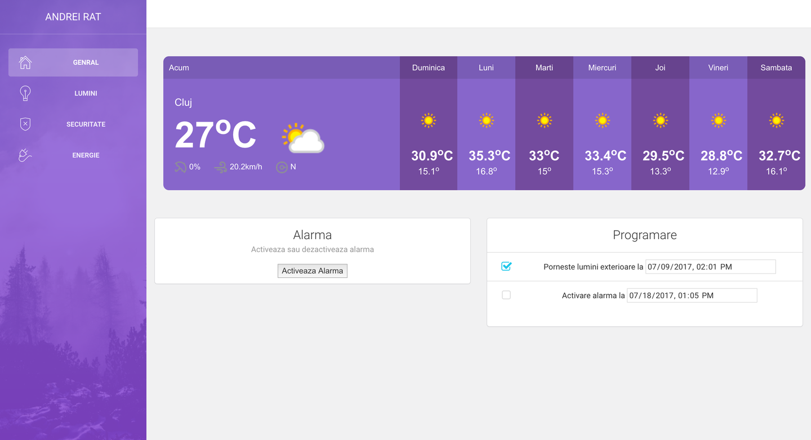
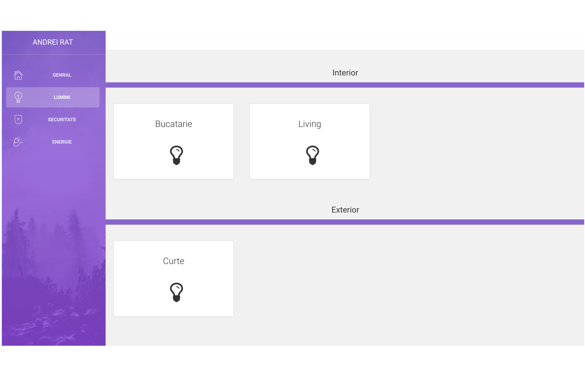

# SmartH


SmartH is an web application which works with Raspberry Pi 3. This app contains an NodeJs server which runs only on Raspberry Pi. The main scope of this project is to let users controll home appliances easly, to monitor different sensors and to offer to users confort and a way to make things more efficient. 

  - Type some Markdown on the left
  - See HTML in the right
  - Magic

# Features

  - Turn different lights ON/OFF
  - Activate/Deactivate alarm
  - Monitor motion sensor
  - Generate graph with every detected motion at exact time
  - Generate energy output of an solar system based on solar radiation and system parameters
  - Real time interraction using Socket.Io

### Tech

* [AngularJS] 
* [Socket.IO] 
* [Johnny-Five] 
* [Raspi.Io] 
* [HTML] 
* [CSS]
* [Node.js] 
* [Express] 
* [jQuery] 
* [Javascript]

### Installation

Clone this repository on your Raspberry Pi 3.
SmartH requires [Node.js](https://nodejs.org/) v4+ to run.

Install the dependencies and devDependencies and start the server.

```sh
$ cd SmartH
$ npm install
$ bower install
$ npm install
```

### Development

Want to contribute? Great!
Open your favorite Terminal and run these commands.

```sh
$ sudo node smart.js
```

Verify the deployment by navigating to your server address in your preferred browser from Raspberry Pi 3: 

```sh
127.0.0.1:3000
```

or from another device connected in the same network with Raspberry Pi 3:

```sh
raspberry_pi_ip:3000
```

where **raspberry_pi_ip** is the IP of the Raspberry Pi 3.

### Screenshots





### Current circuit schema


### Todos

 - Write MOAR Tests
 - Add more features
 - Improve security
 - Add more online services

License
----

MIT


**Free Software, Hell Yeah!**

[//]: # (These are reference links used in the body of this note and get stripped out when the markdown processor does its job. There is no need to format nicely because it shouldn't be seen. Thanks SO - http://stackoverflow.com/questions/4823468/store-comments-in-markdown-syntax)


